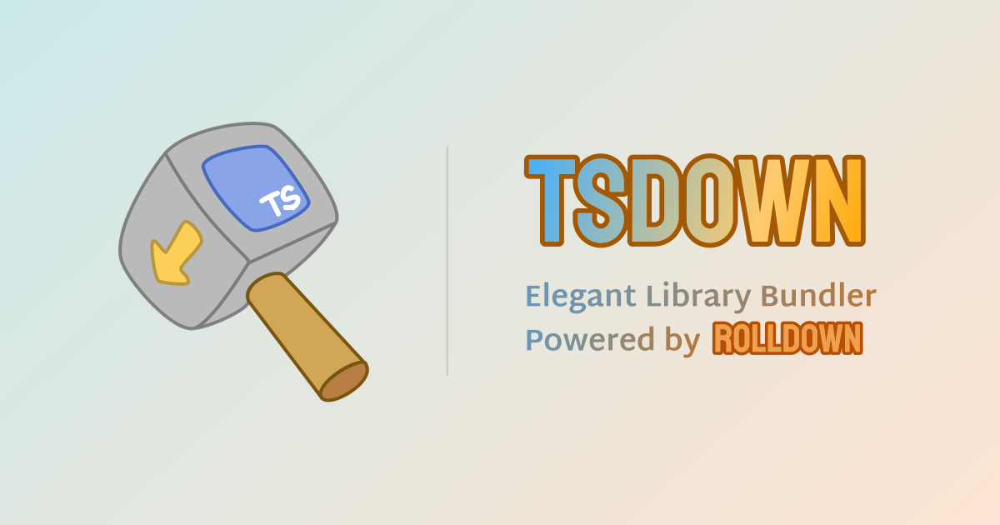

 

## 🇷🇺 Русскоязычная документация   tsdown

[![npm version][npm-version-src]][npm-version-href]
[![npm downloads][npm-downloads-src]][npm-downloads-href]
[![Unit Test][unit-test-src]][unit-test-href]
[![tsdown Starter StackBlitz][tsdown-starter-stackblitz-src]][tsdown-starter-stackblitz-href]

✨ Элегантный сборщик для библиотек, работающий на Rolldown.

**Документация на русском: [tsdown.ru](https://tsdown.ru)**

**Официальный репозиторий: [github.com/rolldown/tsdown](https://github.com/rolldown/tsdown/)**

> [!IMPORTANT]
> ⚠️ **Важно**: Это **неофициальный** перевод документации [tsdown](https://github.com/rolldown/tsdown/), поддерживаемый сообществом. 
> Официальная документация: [tsdown.dev](https://tsdown.dev).

 

  

[npm-version-src]: https://img.shields.io/npm/v/tsdown.svg
[npm-version-href]: https://npmjs.com/package/tsdown
[npm-downloads-src]: https://img.shields.io/npm/dm/tsdown
[npm-downloads-href]: https://www.npmcharts.com/compare/tsdown?interval=30
[unit-test-src]: https://github.com/rolldown/tsdown/actions/workflows/unit-test.yml/badge.svg
[unit-test-href]: https://github.com/rolldown/tsdown/actions/workflows/unit-test.yml
[tsdown-starter-stackblitz-src]: https://developer.stackblitz.com/img/open_in_stackblitz_small.svg
[tsdown-starter-stackblitz-href]: https://stackblitz.com/github/rolldown/tsdown-starter-stackblitz
